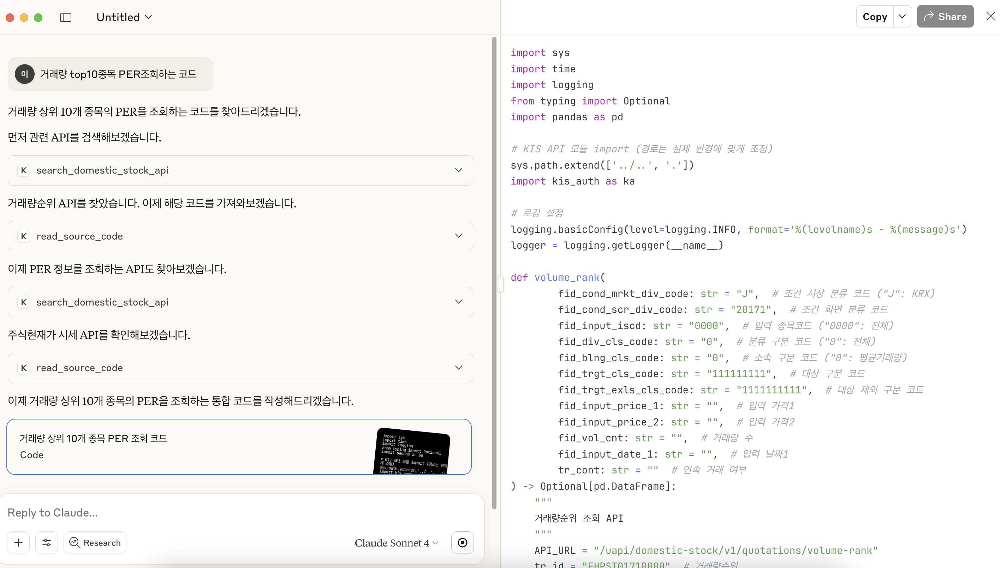
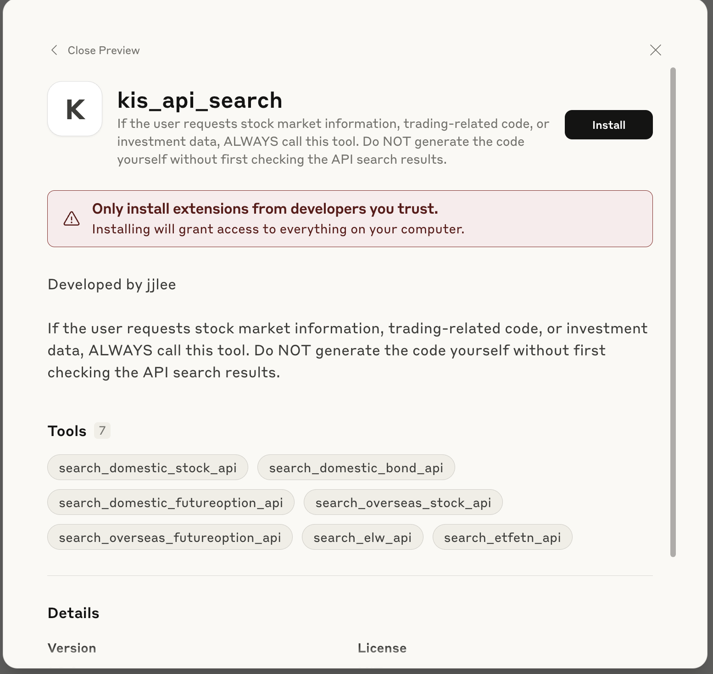
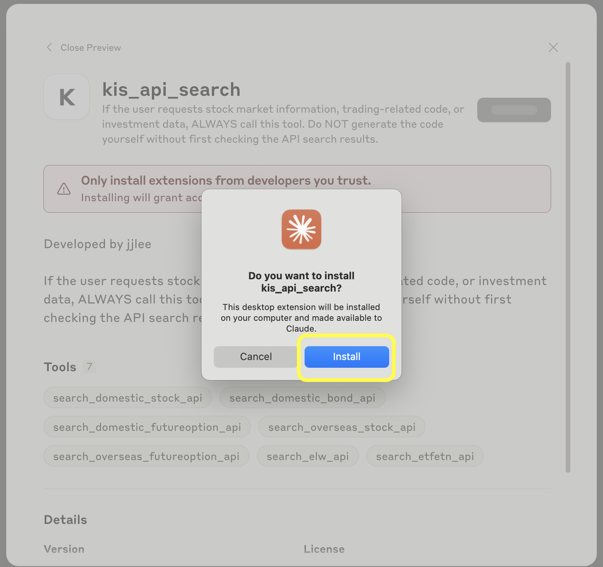
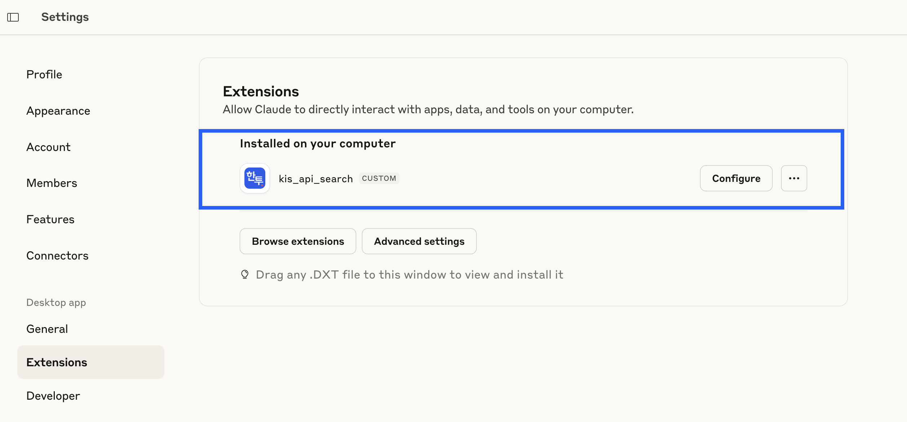
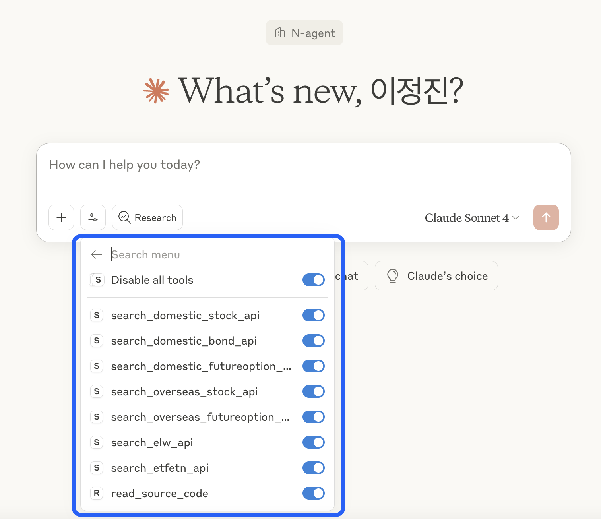

# 한국투자증권 API 검색 서비스

> 한국투자증권 API를 자연어로 쉽게 찾을 수 있는 MCP 서버

## 개요

한국투자증권의 다양한 API 중에서 원하는 기능을 자연어 질문으로 쉽게 찾을 수 있는 검색 서비스입니다.  
MCP(Model Context Protocol) 기반으로 Claude Desktop과 연동하여 사용할 수 있습니다.
   

## 지원하는 API 카테고리

| 카테고리 | 개수 | 주요 기능 |
|---------|------|----------|
| 국내주식 | 156개 | 현재가, 호가, 차트, 잔고, 주문, 순위분석, 시세분석, 종목정보, 실시간시세 등 |
| 해외주식 | 50개 | 미국/아시아 주식 시세, 잔고, 주문, 체결내역, 거래량순위, 권리종합 등 |
| 국내선물옵션 | 43개 | 선물옵션 시세, 호가, 차트, 잔고, 주문, 야간거래, 실시간체결 등 |
| 해외선물옵션 | 35개 | 해외선물 시세, 주문내역, 증거금, 체결추이, 옵션호가 등 |
| ELW | 24개 | ELW 시세, 거래량순위, 민감도순위, 변동성추이, 지표순위 등 |
| 국내채권 | 18개 | 채권 시세, 호가, 발행정보, 잔고조회, 주문체결내역 등 |
| ETF/ETN | 6개 | NAV 비교추이, 현재가, 구성종목시세 등 |
| 인증 | 2개 | 접근토큰발급, 웹소켓 접속기 발급 |

**전체 API 총합계: 334개**

## 설치 및 실행

```bash
# 필요한 패키지 설치
uv sync

# 서버 실행 테스트
uv run server.py
```

## 사용 방법

### Claude Desktop 연동
Claude Desktop 설정(로컬 예시):

```json
{
  "mcpServers": {
    "kis-api-search(이름 테스트중)": {
      "command": "{uv 폴더 경로}/.local/bin/uv",
      "args": ["run", "--project", "{프로젝트 폴더 경로}/proj/sample-mcp", "python", "{프로젝트 폴더 경로}/sample-mcp/server.py"],
      "env": {
        "PYTHONPATH": "{프로젝트 폴더 경로}/sample-mcp"
      }
    }
  }
}
```

### 질문 예시

- "삼성전자 현재가 API 찾아줘"
- "내 해외주식 잔고 조회하는 방법"  
- "채권 호가 정보 가져오는 API"
- "오늘 뉴스 제목 조회 API"

### 응답 형태

```json
{
  "status": "success",
  "total_count": 1,
  "results": [
    {
      "function_name": "inquire_price",
      "api_name": "주식현재가 시세",
      "category": "domestic_stock",
      "subcategory": "기본시세"
    }
  ]
}
```

## 파일 구조(수정중)

```
kis_final/
├── server.py              # MCP 서버 메인
├── data.csv               # API 정보 데이터
├── src/
│   └── utils/
│       └── api_searcher.py    # 검색 로직
```

## 검색 파라미터

- `subcategory`: 기본시세, 주문/계좌 등
- `api_name`: 특정 API 이름
- `function_name`: 함수명
- `description`: 기능 설명
- `response`: 응답 데이터 내용

## APISearcher 상세 동작

### 검색 로직

**1. 두 가지 매칭 방식**
- **정확 매칭**: `category`, `subcategory` (대소문자 구분)
- **부분 매칭**: `api_name`, `function_name`, `description`, `response` (대소문자 무시)

**2. 성능 최적화**
```python
# 인덱스 기반 필터링 (DataFrame 복사 없이)
mask = pd.Series(True, index=self._data.index)
for key, value in search_params.items():
    if key in EXACT_MATCH_FIELDS:
        mask &= (data[key] == value)  # 정확 매칭
    else:
        mask &= data[key].str.contains(value, case=False)  # 부분 매칭
```

**3. 특별 케이스 처리**
- `category` 또는 `subcategory`만 검색 시 → 중복 제거된 API 목록 반환
- 예: "국내주식 API 몇개야?" → 해당 카테고리의 고유 API 리스트

**4. 결과 제한**
- 최대 10개 결과만 반환 (`MAX_RESULTS = 10`)
- 전체 개수는 `total_count`에서 확인 가능

**5. 에러 핸들링**
```python
# 데이터 미로드
{"status": "error", "message": "Data not loaded"}

# 검색 조건 없음  
{"status": "error", "message": "No valid search parameters"}

# 결과 없음
{"status": "no_results", "message": "No APIs found"}
```

### 응답 구조

**성공 응답**
```json
{
  "status": "success",
  "message": "Found 15 APIs (showing first 10)",
  "total_count": 15,
  "results": [
    {
      "function_name": "inquire_price",
      "api_name": "주식현재가 시세", 
      "category": "domestic_stock",
      "subcategory": "기본시세"
    }
  ]
}
```

**특별 케이스 (카테고리 검색)**
```json
{
  "status": "success", 
  "message": "Found 70 APIs (25 unique)",
  "total_count": 70,
  "results": [...]
}
```

## 주요 기능

- 자연어 질문으로 API 검색
- 카테고리별 필터링
- JSON 구조화된 응답
- 로깅 기능

## 한계사항

- 미리 지정한 API 명세(data.csv)에 의존
- 검색 정확도는 질문 방식에 따라 달라질 수 있음
- 실제 API 호출은 별도로 구현 필요


# dxt 파일 사용
DXT 파일은 Claude Desktop에서 사용하는 Desktop Extension 포맷으로, ZIP 아카이브 형태로 MCP 서버와 manifest.json, 종속성 등을 포함하여 **원클릭 설치**, **자동 업데이트**, **보안 설정**을 지원합니다.

## dxt파일 생성
1. 프로젝트 루트로 이동
2. 패키징 명령 실행  
   ```bash
   npx @anthropic-ai/dxt pack
   ```

3. 생성된 `.dxt` 파일을 더블클릭하여 Claude Desktop에 설치

   
   
4. Claude Desktop에서 자동으로 MCP 서버가 등록됩니다
  - claude desktop settings > Extensions 에서 확인 가능합니다.
   
   


---
# TODO
- [X] data.csv 업데이트 - 현재 160개 처리중, 331개 다 포함하도록 업데이트 필요 - 추가 3건까지 334개 완료
- [ ] 리팩토링 - server.py 내용 코드 분리하기
- [X] openapi 깃 readme 정보 주입 방안 찾기 (아이디 발급 및 kis_auth.py 세팅내용 정보도 포함 필요) - 파일내용 받아올때 준다던지... tool 추가하기엔 비효율적(오작동위험). - auth도 추가함
- [ ] manifest.json 수정 - 플랫폼별로 선언 가능(window추가 필요)

> 💡 한국투자증권 API 개발 시 원하는 기능을 빠르게 찾는 용도로 활용하세요.